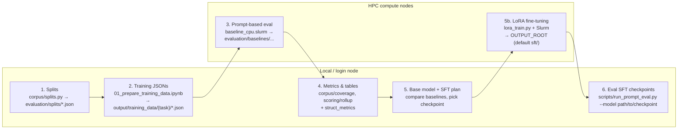

# Structured Supervision for Transformer Language Models 

## Introduction
Many poems follow formal constraints, repeatable rules about sound and structure. Two common examples are:
- **Rhyme**: the end words of lines share similar sounds (*day / play*).
- **Meter**: lines follow a repeating pattern of stressed and unstressed syllables ( da-DUM da-DUM da-DUM…).
Modern transformer language models often generate fluent text, but they struggle to reliably follow formal constraints—and when they do follow them, they often over-regularize. Iambic pentameter is a meter in which each line has five iambs: one unstressed syllable followed by one stressed, “da-DUM”. Example: I ate / my sis / ter's soup/ and it / was good. “Generative Aesthetics: On formal stuckness in AI verse” finds that LLM-generated sonnets are more uniformly iambic. Models also rhyme even when explicitly asked not to. This “formal stuckness”—defaulting to the most frequent patterns, iambic pentameter, end-rhyme instead of varying form as requested—suggests that models may be matching training-data statistics rather than applying flexible rules. This project tests whether giving models *explicit training targets* for form—rather than training only on raw poem text—improves their ability to follow meter/rhyme **and** generalize that ability to new poets, genres, and forms. The goal is not to optimize for the best-sounding poem, but to understand how LLMs process poetic form and what that reveals about whether they learn composable rules or only surface patterns.

---

## Approach (overview)

The approach is defined by the pipeline in this repository: extract and normalize source texts, annotate them with formal structure (meter, stress, rhyme, lineation), export to SQLite, then build train/dev/test splits and **four parallel task conditions** (natural_text, meter_only, rhyme_only, combined) so the same backbone model can be evaluated and trained under different target formats. Nothing in the *engineering* assumes a single literary genre beyond what the corpus contains—the same machinery applies to any line-level annotations stored in `corpus.db`. The workflow is: **prompt-based evaluation** on shared test JSONs (zero/one/few-shot; **scripts/run_prompt_eval.py** for both Hub models and merged SFT checkpoints) → **metrics / comparison** → **supervised fine-tuning (SFT)** per task with matched hyperparameters → **re-eval** checkpoints on the same test JSONs. Gold labels always come from the annotation pipeline. The rest of this document walks through each stage and the code paths that implement it.


### Data Source
Source: The poetry comes from the Eighteenth-Century Poetry Archive (ECPA), a peer-reviewed digital archive of English-language poetry from the long eighteenth century (1660-1800). The repo is at 
https://github.com/alhuber1502/ECPA. The project expects a local copy in the project root so poem files live at ECPA/web/works/<poem_id>/<poem_id>.xml.

TEI(Text Encoding Initiative) ECPA encodes poems in TEI P5. TEI is a standard for representing literary and linguistic texts in XML so that structure (stanzas, lines, metadata) is machine-readable. Each poem file is a TEI document with a root <TEI> element, inside it we use:
- <title>, author
- body
- <lg> line group—a stanza which is a group of lines together in poem; each <lg> contains one or more lines 
- <l> line—a single verse line, some of the line text may be wrapped in elements like <w> (word) or <pc> (punctuation), or appear as a direct text. 

For processing the standard TEI P5 namespace in Python: the [lxml XPath and namespaces](https://lxml.de/4.4/xpathxslt.html) docs (see “Namespaces and prefixes”) show how to use `find()`/`findall()` with `{http://www.tei-c.org/ns/1.0}localname` or `xpath()` with a `namespaces` dict. A tutorial with examples is [Parsing TEI XML documents with Python](https://komax.github.io/blog/text/python/xml/parsing_tei_xml_python/). TEI structure means that the archive's lines and stanza structure is already noted, so we don't have to infer. 
The data was extracted in sample/extract_sample.py (single-poem logic) and batch/extract_batch.py (full corpus). For each XML file under ECPA/web/works/*/*.xml (excluding non-poem files like tei_all.rnc):
1. Parse the XML with lxml (etree.parse())
2. Read title and author from the first matching  <title> and <author>
3. Find the <body> element; from it, find all <lg> elements (stanzas)
4. For each <lg> find all <l> elements lines. Collect all text in document order with itertext() and skip blank lines. 
5. Build a structured dict: id (filename stem, e.g. bah18-w0160), author, title, stanzas (list of lists of line strings). Shape:

```
poem (dict)
├── id        → string (e.g. "bah18-w0160")
├── author    → string
├── title     → string
└── stanzas   → list of stanzas
               ├── stanza 0 → list of line strings  ["line 1", "line 2", ...]
               ├── stanza 1 → list of line strings  ["line 1", "line 2", ...]
               └── ...
```

Example JSON:

```json
{
  "id": "bah18-w0160",
  "author": "Author Name",
  "title": "Poem Title",
  "stanzas": [
    ["First line of stanza 1.", "Second line of stanza 1."],
    ["First line of stanza 2.", "Second line of stanza 2."]
  ]
}
```

The sample script runs this on a few fixed poem IDs for verification; the batch script runs extract_poem() on every XML and writes one JSON per poem to output/poems/<id>.json. That is the raw extracted corpus: line and stanza boundaries are fixed; normalization is a separate step. **Incremental runs:** Extract, normalize, and annotate batch scripts all skip work that is already done: if output/poems/<id>.json (or the normalized/annotated counterpart) exists, that poem is skipped. Use `--force` (or `-f`) when calling a batch script to reprocess everything.

### Normalization
Raw TEI text has curly quotes, smart apostrophes, em dashes, and inconsistent spacing. I kept both the raw and normalized text per line so nothing is discarded and we can always trace back to the source. 

What we normalized. Implemented in sample/normalize_sample.py (per-poem) and batch/normalize_batch.py (full corpus). For each line we:
- collapse multiple spaces, newlines, and tabs
- replace en-dash and em-dash with a single hyphen
- replace curly double quotes and curly/smart apostrophes with straight ASCII equivalents
- remove space immediately before punctuation (e.g. `word ,` → `word,`)

Example: `"  'T is  slumb'ring  —  "` (raw) becomes `"'T is slumb'ring - "` (normalized): spaces collapsed, curly apostrophe standardized to straight, em-dash to hyphen; the contraction form is unchanged.

Poetic contractions like `'T is`, `slumb'ring` are preserved; only the apostrophe character is standardized so tokenization and dictionary lookup are consistent. Normalization reads **output/poems/<id>.json** and writes **output/poems_normalized/<id>.json**. Each stanza becomes a list of line objects, each with `raw` and `normalized` text. Structure:

```
normalized poem (dict, same id/author/title as input)
└── stanzas   → list of stanzas
                ├── stanza 0 → list of line objects
                │              ├── { "raw": "  First line.  ", "normalized": "First line." }
                │              ├── { "raw": "  'T is  slumb'ring  —  ", "normalized": "'T is slumb'ring - " }
                │              └── ...
                ├── stanza 1 → list of line objects  { "raw": "...", "normalized": "..." }
                └── ...
```

Example JSON (one stanza, two lines):

```json
{
  "id": "bah18-w0160",
  "author": "Author Name",
  "title": "Poem Title",
  "stanzas": [
    [
      { "raw": "  First line  ,  with spaces.  ", "normalized": "First line, with spaces." },
      { "raw": "'T is slumb'ring — still one word.", "normalized": "'T is slumb'ring - still one word." }
    ]
  ]
}
```
### Creating our Structured Dataset

After normalization, each poem is annotated with **phonology** (the sound form of words—which vowels and consonants, and how they are pronounced), **meter**, **stress**, **rhyme**, and line-level features: **end_stopped** (whether the line ends at a grammatical boundary, e.g. period or comma), **caesura** (position of a pause or break within the line), and **enjambment** (the line runs on without a pause into the next). These labels are the gold targets for training and evaluation. The pipeline uses two main tools.

#### Where these things are coming from 

- **[Poesy](https://github.com/quadrismegistus/poesy)** supplies **rhyme groups** (which lines rhyme with which, e.g. labeled "a", "b" so lines with the same letter rhyme), **metrical parses** (how a line fits a beat pattern), and **stress** patterns. It is built on **[Prosodic](https://github.com/quadrismegistus/prosodic)**. Prosodic uses **constraint-based metrical parsing**: *Scansion* is the process of deciding which syllables in a line are “strong” (stressed, carrying a beat) and which are “weak” (unstressed). In verse, the same word can be promoted or demoted to fit the meter, so we cannot rely on dictionary stress alone. Constraint-based parsing treats this as a **constraint-satisfaction** task: we have rules (e.g. “iambic pentameter = five weak–strong pairs”) and preferences (e.g. “align word stress with beat stress when possible”). The system considers possible readings and picks the one that best satisfies those constraints (formally, this is often done with **Optimality Theory**, which ranks candidate analyses). So we get a metrical reading of the line—which syllables count as strong or weak in context—not just a raw dictionary lookup. Prosodic outputs **stress as +/- per syllable**: a string like `+-+-+` where `+` = stressed (strong beat) and `-` = unstressed (weak beat). **Meter as parse strings** means a representation of the line split into feet or beats (e.g. `TI|red|NA|tures|SWEET|...`) so we can see which syllables are strong (capitals) and weak (lowercase).

- The **[CMU Pronouncing Dictionary](http://www.speech.cs.cmu.edu/cgi-bin/cmudict)** gives **ARPAbet phonology**: a standard way to write American English pronunciation as a sequence of phoneme codes (e.g. `S L IY1 P` for "Sleep"). ARPAbet uses digits 0/1/2 on vowels for stress (0 = unstressed, 1 = primary, 2 = secondary). Phonology from CMU is used for **every line**. When Poesy/Prosodic does not return a line-level metrical stress string, the code can fill **`stress`** with a **lexical** stress pattern derived from CMU vowel stress (see `phones_to_stress` / dictionary-based helpers in `sample/phonology_sample.py`). That fallback is *not* promoted metrical stress—it is a syllable-level 0/1 pattern converted to `+`/`-` for training/eval coverage. When Poesy fails entirely, CMU-derived hints still support **meter_type** labels where implemented.

**Parsing in the upstream tools.** To see the parsing output that our pipeline draws on: **[Poesy README](https://github.com/quadrismegistus/poesy/blob/master/README.md)** shows `poem.summary()` — a table of parse string, rhyme, #feet, #syll per line — and `poem.statd` (meter type, rhyme scheme). **[Prosodic README.ipynb](https://github.com/quadrismegistus/prosodic/blob/master/README.ipynb)** has runnable examples of the metrical parser. Our code uses Prosodic under the hood (with compatibility patches in phonology_sample.py) and maps parse/rhyme into our JSON (`stress`, `meter`, `rhyme_group` per line).

**Why these metrics?** We need to know whether the model got meter and rhyme right. Our pipeline (Poesy + CMU) gives us stress pattern, meter type, and rhyme labels per line—so we use those. We score a line as correct only when the *entire* stress or rhyme string matches the gold; one wrong syllable means the whole line is wrong. Researchers have shown that LLMs tend to be overly regular more strictly iambic and more often rhyming than human poets. Our metrics let us measure that and compare baseline vs fine-tuned models: we run each model on the same test prompts, get its output lines, and compare them to the gold stress/rhyme from our pipeline (e.g. stress-match rate, rhyme rate); we do this for **pretrained** prompt baselines and for **fine-tuned** checkpoints so we can see whether training improves adherence or changes how regular the output is. Other studies of poetry and LLMs use the same kind of measures (stress, rhyme rate), so we can compare our results to theirs. End_stopped, enjambment, and caesura capture how lines break and pause, for optional analysis.

**Output structure:** Implemented in sample/phonology_sample.py (single poem) and batch/phonology_batch.py (full corpus). Reads output/poems_normalized/<id>.json, writes output/poems_annotated/<id>.json. Shape:
```
annotated poem (dict)
├── id, author, title   (unchanged)
├── stanzas             → list of stanza objects
│   ├── stanza_index, stanza_type, rhyme_scheme, rhyme_pairs
│   └── lines           → list of line objects
│       ├── raw, normalized, stanza_index, line_index
│       ├── end_stopped, caesura, enjambment
│       ├── phonology   → list of { word, arpabet, source } per word
│       ├── rhyme_word  → string (last content word)
│       ├── rhyme_group → from Poesy (e.g. "a", "b") or empty
│       ├── meter       → Poesy parse string or CMU-derived stress pattern
│       ├── stress      → "+-+-..." from Poesy when available; else CMU-lexical fallback when possible
│       └── meter_type  → e.g. "iambic pentameter" (Poesy poem-level or per-line from phonology)
└── annotation_sources  → { stress_poesy, stress_empty, meter_poesy, meter_phonology, ... }  (optional)
```
```json
{
  "normalized": "Tired Nature's sweet restorer, balmy Sleep!",
  "phonology": [
    { "word": "Tired", "arpabet": ["T AY1 ER0 D"], "source": "cmudict" },
    ........
    { "word": "Sleep", "arpabet": ["S L IY1 P"], "source": "cmudict" }
  ],
  "rhyme_word": "",
  "rhyme_group": "-",
  "meter": "TI|red|NA|tures|SWEET|res|TO|rer|BAL|my|SLEEP",
  "stress": "+-+-+-+-+-+",
  "meter_type": "iambic ......",
  "end_stopped": true,
  "caesura": 4,
  "enjambment": false
}
```
#### Final Checks
Export to SQLite (`python scripts/export_sqlite.py`), then run `python evaluation/run_annotation_coverage.py` on the corpus. That writes `evaluation/annotation_coverage.json` (coverage percentages plus meter histogram, degraded-poem counts, stanza types, etc.) before building training data and evaluation splits. Extra CSV filters and corpus/training alignment checks live in **scripts/eval_cli.py** (e.g. `verify-data`, `filter-csv`).

---

### Evaluation and choosing a model

After the corpus is built and annotated, we (1) define evaluation splits and metrics, (2) prepare train/dev/test data for each task, (3) run **prompt-based evaluation** (pretrained baselines on the GPU or CPU Slurm grid), (4) compute metrics and compare, (5) choose a base model and run **supervised fine-tuning** per task, (6) evaluate merged checkpoints with the same **scripts/run_prompt_eval.py** path as step (3). The **evaluation/** and **scripts/** directories implement this; **requirements.txt** bundles corpus dependencies and the SFT stack (install PyTorch separately to match your hardware).

**Flow (high level):**



**Step 1 — Splits and metrics.** We split the corpus into train, dev, and test (and optionally held-out poets/poems) so we can measure generalization. Run `python evaluation/splits.py` (implementation: `evaluation/corpus/splits.py`); outputs live in `evaluation/splits/` (e.g. `train.json`, `test.json`, `held_out_poems.json`). SQLite **annotation coverage** counts are in `evaluation/corpus/metrics.py`.

*How splits are built.* The script (1) connects to `output/corpus.db`, (2) gets all poem IDs and groups them by author, (3) reserves *held-out poets* (e.g. 10 authors with ≥3 poems—all their poems go to `held_out_poets.json`), (4) from the rest, randomly selects *held-out poems* (e.g. 100 poems → `held_out_poems.json`), (5) splits the remaining poems by fractions (e.g. 70% train, 15% dev, 15% test) with a fixed random seed (42) for reproducibility, (6) writes each list of poem IDs to `evaluation/splits/{train,dev,test,held_out_poets,held_out_poems}.json` and a `meta.json` with counts. The prepare-training-data notebook and **run_prompt_eval.py** then use these IDs to decide which lines belong to which split.

```python
# evaluation/corpus/splits.py (simplified)
random.seed(42)
# Held-out poets: N authors, all their poems
held_out_poet_ids = [...]  # from authors_with_enough[:10]
# Held-out poems: N random poems not in held_out_poets
rest = [p for p in all_poem_ids if p not in held_out_poet_ids]
held_out_poem_ids = random.sample(rest, 100)
rest = rest[100:]
# Train / dev / test from the rest (70 / 15 / 15)
train_ids = rest[:int(0.7*len(rest))]
dev_ids = rest[...]
test_ids = rest[...]
for name, ids in [("train", train_ids), ("dev", dev_ids), ("test", test_ids), ...]:
    json.dump(ids, open(SPLITS_DIR / f"{name}.json", "w"), indent=2)
```

*Where it runs:* Local or login node (no GPU). See **Running on HPC (summary)** below for the full workflow.

**Step 2 — Prepare test data for each task.** The four training conditions (natural_text, meter_only, rhyme_only, combined) each need a test set: input prompts plus gold targets. The notebook `notebooks/01_prepare_training_data.ipynb` builds these from the corpus and writes JSONs to `output/training_data/{task}/test.json` (and train/dev). Those files are the input to the prompt-based eval script (`scripts/run_prompt_eval.py`).

*How they were built.* The notebook (1) loads poem IDs per split from `evaluation/splits/{train,dev,test}.json`, (2) connects to `output/corpus.db` and iterates over lines in those poems (normalized text, stress, meter_type, rhyme_group, phonology, end_stopped, caesura), (3) for each condition builds a list of `{"input": ..., "target": ...}` pairs, then (4) writes each list to `output/training_data/{condition}/{split}.json`. The pairing logic is:

- **natural_text:** input = previous line(s) in the **same poem** (joined with ` | `) or `[start]`; target = **next line** surface text (continuation). Context does not cross poem boundaries.
- **meter_only:** input = line text; target = stress pattern as `+`/`-` (only lines with valid stress, 5+ syllables).
- **rhyme_only:** input = line text; target = rhyme key from phonology (last stressed syllable onward) or rhyme_group.
- **combined:** **same input as natural_text** (continuation context); target = bundled string for the **next** line, e.g. `stress:+-+-+-+-+|meter_type:iambic Pentameter|rhyme:IY1 P|end:1|caesura:3` (pipe-separated fields). The metrics code also accepts an older four-field `meter:|rhyme:|end:|caesura:` layout for backward compatibility—see `evaluation/scoring/struct_metrics.py`. Rows may include `next_line` for strict-eval alignment in `run_prompt_eval.py`.

Example (meter_only): one row in `test.json` is `{"input": "Tired Nature's sweet restorer, balmy Sleep!", "target": "+-+-+-+-+-+"}`. Example (combined): `{"input": "…prior line…", "target": "meter:+-+-+-+-+-+|rhyme:IY1 P|end:1|caesura:4", "next_line": "…actual next line text…"}`. The eval script reads these JSONs, turns each `input` into a prompt (using the task template), and sends the prompt to the model; the `target` is the gold used for metrics.

Minimal code pattern (from the notebook):

```python
# Load which poem IDs are in test split
test_ids = json.load(open(SPLITS_DIR / "test.json"))

# Query corpus.db for lines in those poems
def iter_lines(conn, poem_ids):
    rows = conn.execute("""
        SELECT poem_id, stanza_index, line_index, normalized, stress,
               meter_type, rhyme_group, rhyme_word, end_stopped, caesura, phonology
        FROM lines WHERE poem_id IN (...)
    """, poem_ids).fetchall()
    for r in rows:
        yield {"normalized": r[3], "stress": r[4], ...}

# Build pairs per condition (e.g. meter_only: input=line text, target=stress string)
meter_test = build_meter_pairs(conn, test_ids)  # list of {"input": "...", "target": "+-+-..."}

# Write to output/training_data/{condition}/test.json
with open(OUT_DIR / "meter_only" / "test.json", "w") as f:
    json.dump(meter_test, f, indent=2)
```

**Step 3 — Prompt-based evaluation (baselines and checkpoints).** We run each candidate model on the *same* test prompts (with an optional `--n` cap for speed). Script: `scripts/run_prompt_eval.py` (single task; supports `--strict-eval`, `--gold-filter`, seq2seq vs `--model_type causal`) or `scripts/hpc/baseline_cpu.slurm` (CPU on **`day`** by default: `--device -1`). **Local Hugging Face checkpoints** should be passed as paths that exist on disk (the script resolves relative paths against the repo root and the current working directory); use a **`checkpoint-*`** directory if training did not reach `final_model/`. **GPU:** run inside an interactive `srun` or a batch script on a GPU partition—do not rely on the login node for large seq2seq jobs. Outputs: `evaluation/baselines/<model_slug>/` by default; **`scripts/hpc/sft_eval.slurm`** writes SFT eval JSONs under **`results/<short_slug>/`** (short names from `evaluation/scoring/slug.py`, not the full checkpoint path).

*How a prompt-eval run works.* The Python script (1) loads test data from `output/training_data/{task}/test.json`, (2) builds one prompt per row from the task’s template (e.g. meter_only zero_shot: “Given this line of poetry, output its metrical stress pattern… Line: {line}”). **Few-shot** prompts prepend a full example **quatrain** (four lines) with per-line labels in the same format as the task (from `corpus.db`), then a separator and the query line. (3) calls the model to generate an output for each prompt, (4) zips each `input`, `gold_target`, `prompt`, and `model_output` into a result dict, (5) writes a single JSON to the chosen results root (default `evaluation/baselines/`, or `results/` for the SFT eval grid) at `<short_slug>/{prompt_type}_{task}.json` containing metadata (model, prompt_type, task, n_samples) and the list of results. That JSON is what Step 4 uses to compute stress-match rate, rhyme match, etc.

**Saved eval JSON shape** (same layout under `evaluation/baselines/` or `results/`):

```
<prompt_type>_<task>.json (e.g. zero_shot_meter_only.json)
├── model           → string (e.g. "google/flan-t5-base")
├── prompt_type     → string (e.g. "zero_shot")
├── task            → string (e.g. "meter_only")
├── n_samples       → number (e.g. 500)
└── results         → list of result objects
    ├── [0]
    │   ├── input        → line text (from test data)
    │   ├── gold_target  → gold stress/rhyme/combined string
    │   ├── prompt       → full prompt string sent to the model
    │   └── model_output → model’s generated string (compared to gold_target in Step 4)
    ├── [1]  { input, gold_target, prompt, model_output }
    └── ...
```

Example (one result entry for meter_only):

```json
{
  "model": "google/flan-t5-base",
  "prompt_type": "zero_shot",
  "task": "meter_only",
  "n_samples": 500,
  "results": [
    {
      "input": "Tired Nature's sweet restorer, balmy Sleep!",
      "gold_target": "+-+-+-+-+-+",
      "prompt": "Given this line of poetry, output its metrical stress pattern...\nLine: Tired Nature's sweet restorer, balmy Sleep!",
      "model_output": "+-+-+-+-+-+"
    }
  ]
}
```

```python
# scripts/run_prompt_eval.py (simplified)
data = json.load(open(DATA_DIR / task / "test.json"))  # or data[:n]
prompts = [build_prompt(item, task, prompt_type) for item in data]
outputs = run_inference_seq2seq(prompts, model_id)  # or run_inference_causal
results = [{"input": item["input"], "gold_target": item["target"], "prompt": p, "model_output": o}
           for item, p, o in zip(data, prompts, outputs)]
out_dir = RESULTS_DIR / baseline_save_slug(model_id)  # hub: google_flan-t5-large; local: task_run folder pair
json.dump({"model": model_id, "prompt_type": ..., "task": ..., "results": results}, open(out_dir / f"{prompt_type}_{task}.json", "w"))
```

*Where it runs:* HPC compute nodes (one Slurm job per model). See **Running on HPC (summary)** below.

**Step 4 — Compute metrics and compare.** Model outputs are compared to gold (same pipeline as in “Why these metrics?”). We compute exact-match and, where useful, **field-level** scores for structured targets via `evaluation/scoring/struct_metrics.py` (rhyme tokens, combined bundles). Natural-text generations can be checked with `evaluation/scoring/form_eval.py` (form signatures). Aggregate tables (e.g. `evaluation/baseline_report/model_comparison.csv` from **`evaluation/summarize_prompt_baselines.py`**, plus optional CSV narrowing via **`scripts/eval_cli.py`** subcommand **`filter-csv`**) support cross-model comparison.

*How metrics are computed.* (A) **Annotation coverage (gold labels):** `python evaluation/run_annotation_coverage.py` runs `evaluation/corpus/coverage.py`, which connects to `corpus.db`, loads poem IDs per split from `evaluation/splits/`, and calls `evaluation.corpus.metrics.merge_metrics_and_diagnostics` for the full corpus and each split. Results go to `evaluation/annotation_coverage.json`. (B) **Model outputs:** JSON trees are rolled up with `python evaluation/summarize_prompt_baselines.py` → `evaluation/scoring/rollup.py` (exact match; structured metrics where configured). **Use the same `--n` cap per task across models** when comparing percentages. *Where it runs:* Local or login node after eval JSON is on disk. See **Running on HPC (summary)** below.

```python
# evaluation/corpus/coverage.py (corpus label coverage; no HF model)
conn = sqlite3.connect(DB_PATH)
results = {"full_corpus": compute_metrics(conn)}
for split_name in ["train", "dev", "test", "held_out_poets", "held_out_poems"]:
    poem_ids = load_split(split_name)
    results[split_name] = compute_metrics(conn, poem_ids)
json.dump(results, open("evaluation/annotation_coverage.json", "w"))
```


**Step 5 — Choose a base model and fine-tune.** After you have prompt-eval numbers for candidate backbones, pick one (e.g. FLAN-T5) and fine-tune it on the same `input`/`target` JSON as training—see **Supervised fine-tuning** below.

---

### Supervised fine-tuning (SFT)

**What it’s for.** Models used **only** with prompting (no task-specific weight updates) see instructions and examples but are not trained on *your* labels. SFT asks: if we **actually train** the model on `train.json` / `dev.json` for each task (`meter_only`, `rhyme_only`, `combined`), does it **predict gold better** than the same backbone run with prompts only? Each task gets its **own** LoRA run so you can compare conditions fairly (meter-trained vs rhyme-trained vs combined-trained), not one mixed soup.

**What happens.** You run **`scripts/sft/lora_train.py`** on a GPU (via **`scripts/hpc/lora_train.slurm`** on Bouchet). It reads the same rows the notebook built (`output/training_data/<task>/{train,dev}.json`), fits small LoRA adapters on top of the frozen base, and writes a new run folder under **`--output-root`** (Slurm defaults to **`sft/<task>_lora/`**). You only need **one** such tree on disk; a second top-level folder like **`sft_full/`** is optional—same mechanism, different **`OUTPUT_ROOT`** if you prefer a separate name for long runs. **`MERGE_AND_SAVE=1`** saves **`final_model_merged/`** so inference is a normal `from_pretrained` path—no extra PEFT wiring in **`run_prompt_eval.py`**.

**How you evaluate it.** You do **not** need a different eval script. **`run_prompt_eval.py`** is the same as for pretrained baselines: point **`--model`** at the merged folder, same **`--task`** and **`--prompt`**, save JSON under **`results/<short_slug>/`** (or pass **`--results-dir`**). That directory is **only** small eval JSON (same layout as `evaluation/baselines/`), not checkpoints—keep it separate from **`sft/…`** so rollups stay small and rsync-friendly. Use **`--max_tokens`** large enough to match what you used as **`max_target_len`** in training so you are not cutting off generations at eval. **`scripts/hpc/sft_eval.slurm`** is a convenience batch: base model plus each merged adapter × three tasks. Roll up with **`evaluation/summarize_prompt_baselines.py --baseline-dir results --out-dir results`**.

**Getting outputs home.** **`rsync`** your training root (whatever **`OUTPUT_ROOT`** you used, often **`sft/`**) and **`results/`** (SFT eval JSON). From your laptop, pull from **`~/Senior-Thesis/`** on Bouchet (VPN if off campus).

**Other Slurm scripts (same folder):** `submit_lora3.sh` submits three training jobs (one task each; default **`OUTPUT_ROOT=sft/<task>_lora`**). Override **`OUTPUT_ROOT`** only if you want weights somewhere else (e.g. **`sft_full/<task>_lora`**); then pass those merged paths into **`sft_eval.slurm`** via **`METER_FT`**, **`RHYME_FT`**, **`COMBINED_FT`**. **`baseline_cpu.slurm`** / **`submit_baselines.sh`** run **CPU** **run_prompt_eval.py** jobs (pretrained prompt eval), not training.

YCRC: [job scheduling](https://docs.ycrc.yale.edu/clusters-at-yale/job-scheduling/), [Bouchet partitions](https://docs.ycrc.yale.edu/clusters/bouchet/).

---

**Running on HPC (summary).**

| Step | Where | Notes |
|------|--------|--------|
| Export DB, splits, notebook training JSONs | Laptop or **login node** | No GPU required. |
| Prompt eval on CPU (default Slurm) | **`sbatch`** → **`partition=day`**, CPU | **`baseline_cpu.slurm`** calls **`run_prompt_eval.py`** with **`--device -1`**; good for Hub models and long CPU inference. |
| Prompt eval or SFT with GPU | **Compute node** | Match **`lora_train.slurm`** / **`sft_eval.slurm`**: e.g. **`gpu_devel`** + **`--gpus=rtx_5000_ada:1`** + **`--account=<your_account>`** + **`--qos=normal`**. On **Yale Bouchet**, interactive jobs often need **`--qos=normal`** (not `interactive`) for GPU partitions; the **`gpu`** partition’s allowed QoS set may differ from your **user** QoS list—follow the **`sacct`** line for successful jobs or use **`gpu_devel`** as in the repo scripts. |
| Logs | User-managed | Use `tee`, **`tmux`**, or `sbatch` stdout files; login-node SSH drops kill bare foreground jobs. |

**Typical commands (Bouchet-style):**

- **CPU prompt-eval batch (matches successful `poetry-baseline` jobs on `day`):**  
  `MODEL=google/flan-t5-base N=500 sbatch --chdir=$(pwd) scripts/hpc/baseline_cpu.slurm`  
  (Override `MODEL`, `PROMPT`, `N` as needed.)

- **Interactive GPU shell for inference or debugging:**  
  `srun --account=YOUR_ACCOUNT --qos=normal --partition=gpu_devel --gpus=rtx_5000_ada:1 --cpus-per-gpu=4 --mem=48G --time=6:00:00 --pty bash`  
  (Use the account from `sshare -U`; confirm QoS with `sacctmgr` / RC docs if policy changes.)

- **Sync:** Keep `output/corpus.db`, `output/training_data/`, and `evaluation/splits/` consistent between laptop and cluster when running eval.

Further options (`HF_TOKEN`, `STAGGER_SEC`, `SPLIT_TASKS`, walltime): see **`scripts/hpc/submit_baselines.sh`** and **`scripts/hpc/baseline_cpu.slurm`**.

### Related work (external)

- **[generative-formalism](https://github.com/quadrismegistus/generative-formalism)** (Heuser 2025, “Generative Aesthetics: On the formal stuckness of AI verse”): Samples historical poetry from a large corpus (e.g. 8K poems by period, 2K by rhyme), generates AI verse via prompts and completions, then runs rhyme and rhythm analysis (Prosodic) on both human and AI outputs and compares. That project uses notebooks for sampling, generation, measurement, and aggregation. **This repository** tracks **`notebooks/01_prepare_training_data.ipynb`** for corpus → task JSON; figures and extra plots can live under **`visualizations/`** (`plot_ft.py`, `ft_figures.ipynb`). Same high-level idea: fixed/sampled data → run models → measure form (stress, rhyme) → compare.
- **[poetry-eval](https://github.com/maria-antoniak/poetry-eval)** (“Sonnet or Not, Bot?”, Walsh et al., EMNLP Findings 2024): Benchmark of 1.4k+ poems with expert form annotations; scripts in `llm-poetic-form-tagging-scripts/` and `analysis/` run LLMs on the data and evaluate (e.g. form identification accuracy). Different task (form tagging vs generation) but same workflow: test set → run baseline models → compute metrics → compare.
